# 图书个性化推荐系统的设计与实现

#### 介绍
本图书个性化推荐系统旨在为学生提供个性化的图书推荐服务，同时提供管理员对系统和学生用户的管理功能。系统基于大数据分析和用户行为学习，为用户推荐符合其兴趣和需求的图书。系统包含两种角色：管理员和学生，每种角色都有其特定的功能模块。

#### 技术栈介绍

后端技术栈：Springboot+Mysql+Maven

前端技术栈：Vue+Html+Css+Javascript+ElementUI

开发工具：Idea+Vscode+Navicate

#### 系统功能介绍

管理员角色功能模块  

学生管理：管理员可以添加、编辑、删除学生用户信息，查看学生用户的借阅记录、阅读偏好等。  

图书分类管理：管理图书的分类，如文学、科学、艺术等，并可以添加、修改或删除分类。  

图书信息管理：负责图书的录入、编辑、删除，包括书名、作者、出版社、ISBN号等详细信息的维护。  

图书预约管理：查看学生的图书预约请求，进行审批或拒绝，并管理预约记录。  

退换图书管理：处理学生的图书退换请求，记录退换原因和处理结果  
。
管理员管理：管理其他管理员账号，包括添加、删除、修改管理员权限等。  

留言板管理：查看并管理学生用户在留言板上的留言，确保留言内容的合规性。  

系统管理：配置系统参数，如数据备份、系统更新、日志查看等。  

学生角色功能模块  

图书信息：浏览图书信息，包括书名、作者、出版社、简介等，并可以按分类、关键词等条件进行搜索。  

好书推荐：系统基于学生的阅读历史和偏好，推荐个性化的图书列表。  

留言反馈：在留言板上发表对图书、系统或其他方面的意见和建议。  

个人中心：查看和修改个人信息，如姓名、学号、联系方式等；查看借阅记录、预约记录、退换记录等。
图书预约管理：对想要借阅但当前不在架的图书进行预约，并查看预约状态。  

退换图书管理：对已借阅的图书进行退换操作，填写退换原因并提交申请。  

我的收藏管理：收藏自己感兴趣的图书，方便后续查看和借阅。  

#### 系统功能截图

登录  

首页

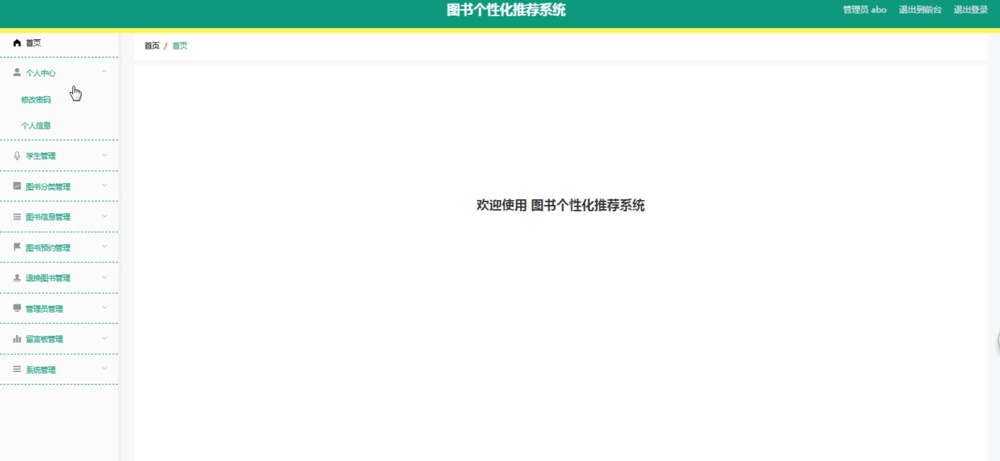

学生端首页

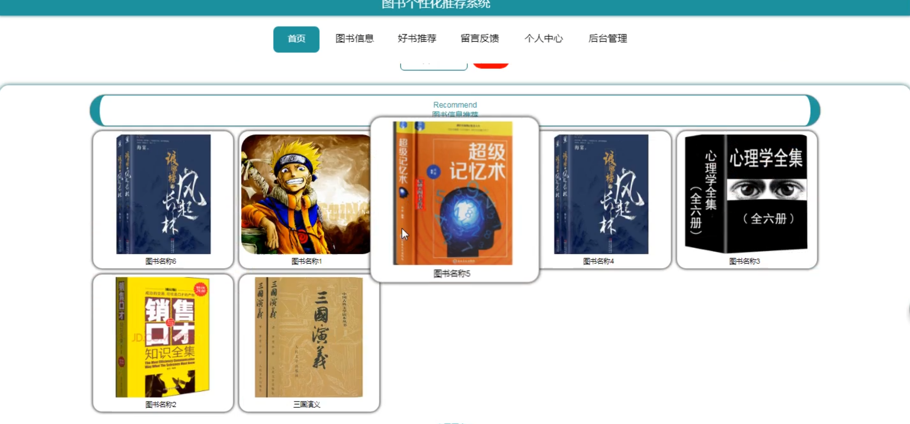

学生管理

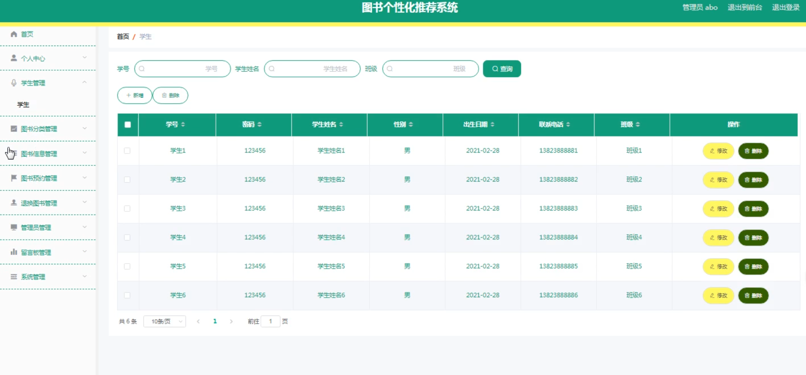

图书分类管理

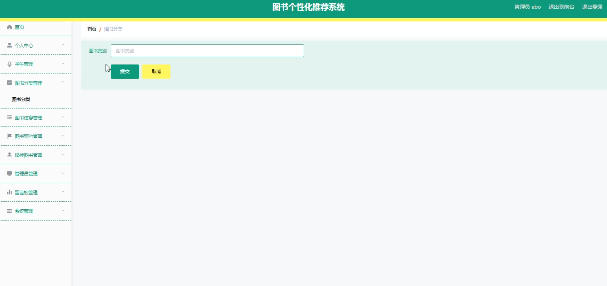

图书信息管理

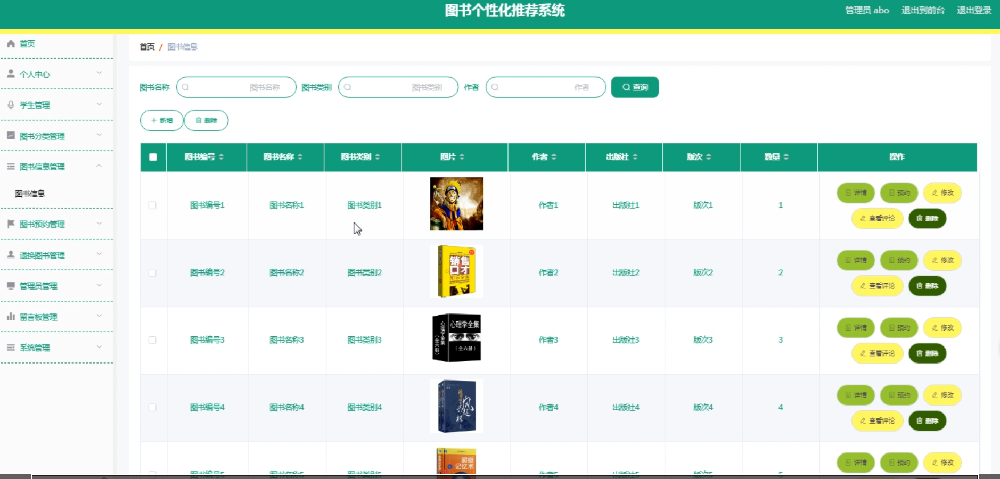

学生端图书信息

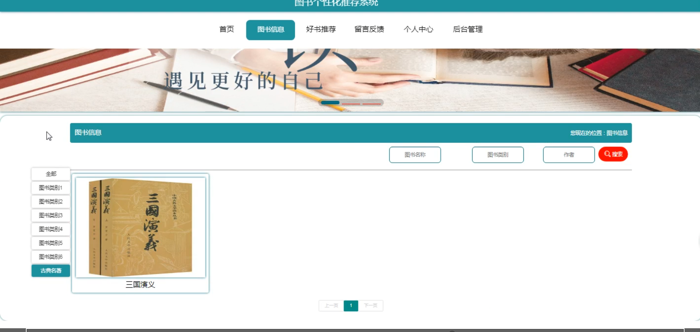

图书预约管理

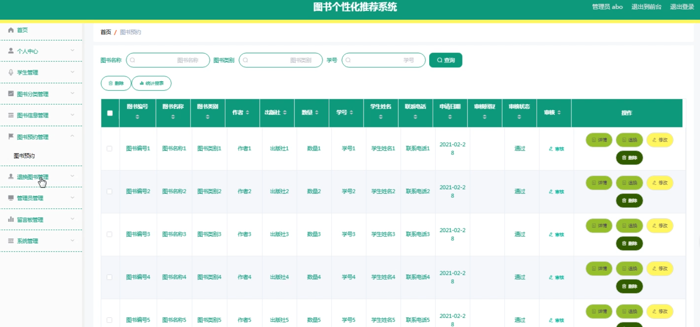

退换图书管理

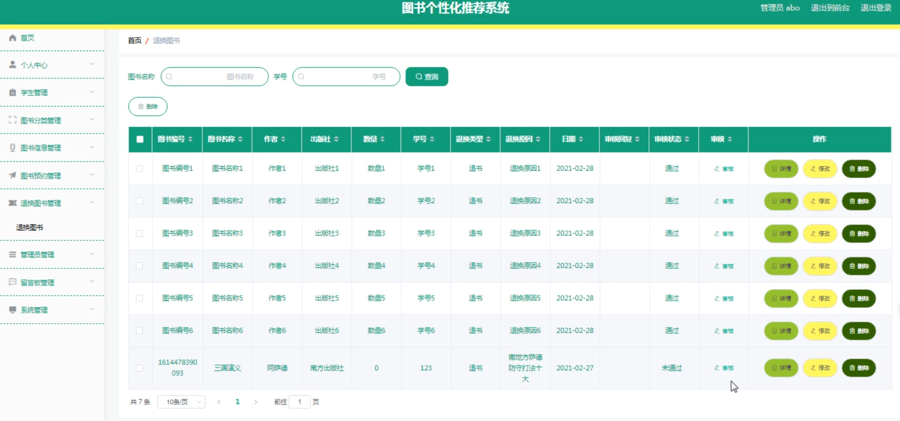

留言板管理

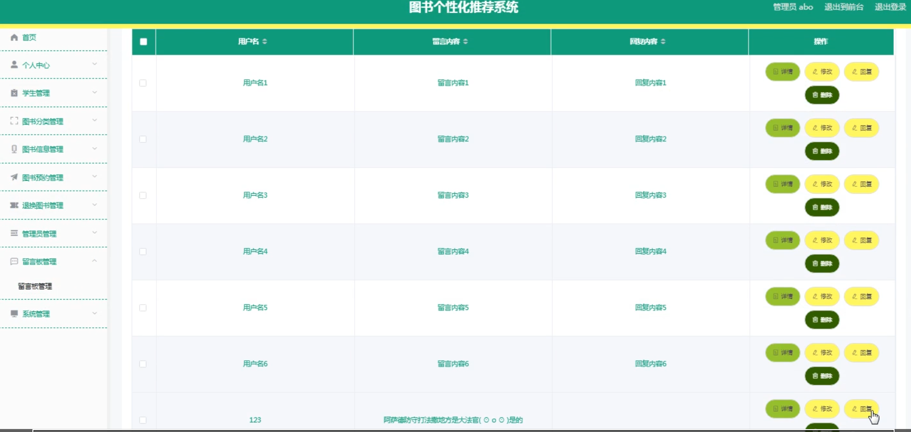

系统管理

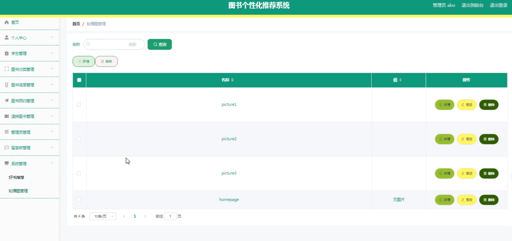

好书推荐

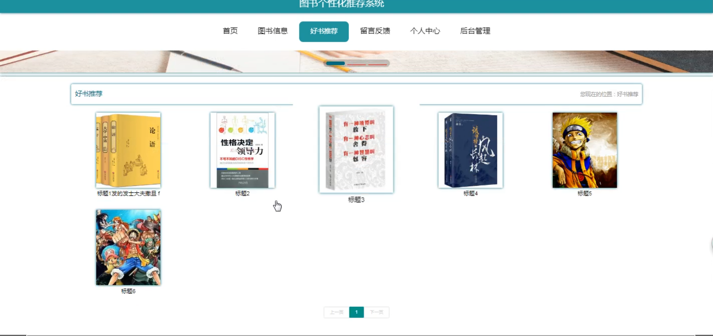

#### 总结

本图书个性化推荐系统为管理员和学生提供了高效、个性化的服务。管理员能全面管理学生和图书信息，确保系统正常运行。学生则享受个性化图书推荐，轻松浏览、预约和退换图书，并可通过留言板互动。系统提升了借阅效率和阅读体验，为双方提供了便捷的服务。

#### 使用说明

后台地址：http://localhost:8080/springbootxs5o6/admin/dist/index.html

管理员  abo 密码 abo

前台地址：http://localhost:8080/springbootxs5o6/front/index.html
